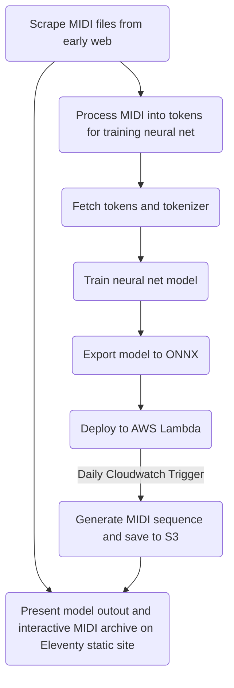

# midi-archive

An informal archive of music on the web before the age of MP3s. This is not intended to be comprehensive, but is instead an archive that exists alongside a companion machine learning model that uses the archive as its corpus - visit [/midi-archive-neural-net](https://github.com/reubenson/midi-archive-neural-net) for the accompanying machine learning model.

This repository implements [Scrapy](https://docs.scrapy.org/en/latest/) to collect MIDI files from websites before Y2K, and [Eleventy](https://www.11ty.dev/) for static site genraeration.

See [https://medium.com/@reubenson/archives-ai-and-music-of-the-early-web-9b2f51fdef47](https://medium.com/@reubenson/archives-ai-and-music-of-the-early-web-9b2f51fdef47) for a broad introduction to the project.

### General Project Workflow

<!-- https://mermaid.live/edit#pako:eNqVU02P2jAQ_SsjSyt5peXUG4dKQIBFottKIHVVcRmcASwSm44dKN3d_96xEz7UnhpFih2_eTPz5vlNGV-S6qtN5U9mhxxhWawcyDPQC8N4IPgyK2awsRUF2LCvgZCrM5xo_Qi93mf4ob8xBXIRaqGqwDdRXkBXgnWRGE20x44F2ezSxjsYV3SUoDOEiNEaCDbSY5c58w6F1xsKoQ0VLg_R78lJGZ4hMlpn3RYcNYyVfGIX_vAAw8ww_2-GXHVzqDyWgoTFJxg2Zn9lbmlHekLR7C5UKSQv7W_iDjjKwEIvU4p7_ixRByoyaKzHvw6eL-pJ1q8vL68dZJwhE12Q1HROh4PvC5hjvS7x1u0ko151gVYGM6p8U54wV8h2u70W1cLe_0EtW9T7VE_JybxiN6xAPxtyhnKHAWVsWZK_VS70PMnlk7o5btANWRxyN9QrfqaH7E-BGExlk22Md45MDHC0mIN8kjykbG2nacVk6GqjNUtGg-Fu4tPM_axvffW67qm80DBhGW52bt0sDbU2vlHJ9rndTS9H6knVxDXaUu7KWzpcqbijmlaqL8sSeb9SK_chOBT_L87OqH7khp5UcyhF0sLilrFuf378AbMIGYw -->

### Installation / Development
- initialize venv `source /Users/reubenson/Projects/midi-archive/.venv/bin/activate`
- install Scrapy
`python3 -m pip install Scrapy`
- `cd scraper` (need to be in the same directory as scrapy.cfg)
- run scraper with `scrapy crawl archive -s LOG_LEVEL=WARNING`
    - before running that command, update the target in the script

### Scraping Workflow
The current process for updating the archive is a bit manual:
- Run the scraper tool, located in `/scraper`
- Run the script for tokenizing all the MIDI files, at `/scripts/apply_tokenizer.py`
- Zip up token json and upload to S3 with `/scripts/deploy_assets.sh`
- MIDI Archive assets are now ready to be ingested by ML model

### Scraper
- [Scrapy architecture](https://docs.scrapy.org/en/latest/topics/architecture.html)
- The spider crawls pages, and then sends additional requests for assets like MIDI files
    - These requests get passed through response middleware, where the response payload is then saved to disk in the assets directory
- Each page is also saved to disk, which is handled in a Pipeline
    - Before getting saved to disk, the HTML needs to be updated, such that references to the assets (MIDI, CSS, images) are updated to point to the self-hosted paths
        - In order to do this, the spider will keep track of every successful request and provide the asset path transformations needed to update HTML in the Pipeline
    - HTML will be saved in a .md file with some additional heading data
- Each page the spider crawls will result in a markdown file, which will then be processed by 11ty to result in HTML pages served via the _sites directory
    - Currently, the site is hosted on GitHub Pages, and will point to the docs directory to serve all static pages and assets

### To Do
- Serve MIDI assets via S3 instead of GitHub
- Expand the archive with new and exciting MIDI discoveries
- Re-implement MIDI player with web components if more complicated features are to be added